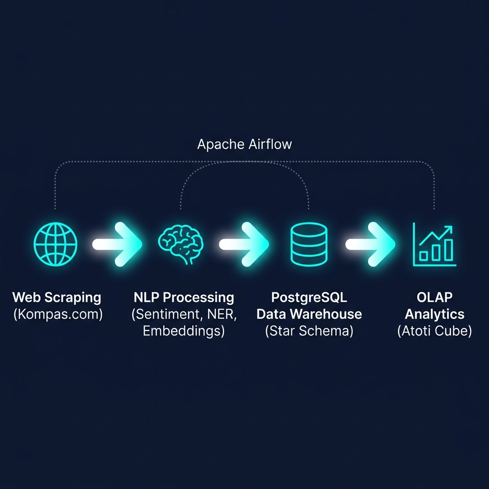

<p align="center">
  
</p>

<h1 align="center">📰 Kompas.com News Data Warehouse</h1>

<p align="center">
  <strong>End-to-End ETL Pipeline with NLP for Trend and Sentiment Analysis of Indonesian News</strong>
</p>

<p align="center">
  
  
  
  
  
</p>

---

## 📋 Table of Contents

- [About the Project](#-about-the-project)
- [Problem Statement](#-problem-statement)
- [System Architecture](#-system-architecture)
- [Data Warehouse Schema](#-data-warehouse-schema-star-schema)
- [Folder Structure](#-folder-structure)
- [Tech Stack](#-tech-stack)
- [Installation Guide](#-installation-guide)
- [How to Run](#-how-to-run)
- [NLP Pipeline](#-nlp-pipeline)
- [OLAP & Multidimensional Analysis](#-olap--multidimensional-analysis)
- [Orchestration with Airflow](#-orchestration-with-airflow)
- [Contributors](#-contributors)

---

## 🎯 About the Project

This project builds a comprehensive **Data Warehouse** that acquires, transforms, and analyzes news data from **Kompas.com** — the largest news portal in Indonesia. This system implements an end-to-end ETL (Extract, Transform, Load) pipeline with **Natural Language Processing (NLP)** components for the Indonesian language, including sentiment analysis, Named Entity Recognition (NER), and vector embedding generation for semantic search.

The data warehouse is designed to support **longitudinal** analysis (2+ years of historical data) through OLAP cubes using **Atoti**, enabling the exploration of news trends, sentiment distribution, and trending topic detection in a multidimensional way.

---

## 🔍 Problem Statement

Kompas.com produces **hundreds of news articles per day** across various categories (national, economy, technology, sports, etc.). Key challenges:

| No | Challenge | Implemented Solution |
|:--:|-----------|----------------------|
| 1 | News data is **unstructured** and scattered across many web pages | Web scraping based on **XML Sitemaps** and index page parsing |
| 2 | **No official public API** from Kompas.com | Automated scraper with rate limiting and error recovery |
| 3 | Trend analysis requires **Indonesian-specific NLP** | IndoBERT pipeline (sentiment) + Multilingual SentenceTransformers (embeddings) |
| 4 | Data volume is too large for longitudinal analysis | **Star Schema** with monthly partitioning and materialized views |
| 5 | Requires **multidimensional** data exploration | OLAP Cube via **Atoti** with custom hierarchies and measures |

### Target Insights

```
📊 Trend of news volume per category per month/year
📈 Distribution and trend of daily news sentiment
🏷️ Top entities (people, organizations, locations) that appear most frequently
🔥 Trending topic detection based on keyword frequency
🔎 Semantic search: find articles based on semantic similarity (vector similarity)
```

---

## 🏗 System Architecture

```
┌─────────────────────────────────────────────────────────────────────┐
│                      Apache Airflow (Orchestrator)                  │
│                     Runs the daily DAG automatically                 │
└──────────┬──────────┬──────────┬──────────┬──────────┬──────────────┘
           │          │          │          │          │
     ┌─────▼─────┐   │    ┌─────▼─────┐   │    ┌─────▼─────┐
     │  EXTRACT  │   │    │ TRANSFORM │   │    │   LOAD    │
     │           │   │    │           │   │    │           │
     │ • Sitemap │   │    │ • Clean   │   │    │ • Upsert  │
     │   Parser  │   │    │ • IndoBERT│   │    │   Dims    │
     │ • Article │   │    │   Sentiment│  │    │ • Insert  │
     │   Scraper │   │    │ • NER     │   │    │   Facts   │
     │ • Histori-│   │    │ • Embed-  │   │    │ • Refresh │
     │   cal     │   │    │   dings   │   │    │   MVs     │
     └───────────┘   │    │ • Trending│   │    └───────────┘
                     │    └───────────┘   │          │
                     │                    │    ┌─────▼─────┐
                     │                    │    │  Supabase  │
                     │                    │    │ PostgreSQL │
                     │                    │    │ + pgvector │
                     │                    │    └─────┬─────┘
                     │                    │          │
                     │                    │    ┌─────▼─────┐
                     │                    │    │   OLAP    │
                     │                    │    │  Atoti    │
                     │                    │    │  Cube +   │
                     │                    │    │  JupyterLab│
                     │                    │    └───────────┘
                     │                    │
                     ▼                    ▼
              📁 data/raw/         📁 data/processed/
```

---

## ⭐ Data Warehouse Schema (Star Schema)

```
                           ┌──────────────┐
                           │  dim_waktu   │
                           │──────────────│
                           │ waktu_id (PK)│
                           │ tanggal      │
                           │ hari         │
                           │ minggu       │
                           │ bulan        │
                           │ nama_bulan   │
                           │ kuartal      │
                           │ tahun        │
                           └──────┬───────┘
                                  │
    ┌──────────────┐    ┌─────────▼──────────┐    ┌──────────────┐
    │ dim_kategori │    │   fact_artikel      │    │ dim_penulis  │
    │──────────────│    │────────────────────│    │──────────────│
    │ kategori_id  │◄───│ artikel_id (PK)    │───►│ penulis_id   │
    │ nama_kategori│    │ url                │    │ nama_penulis │
    └──────────────┘    │ judul              │    └──────────────┘
                        │ konten             │
    ┌──────────────┐    │ waktu_id (FK)      │    ┌──────────────┐
    │ dim_sentimen │    │ kategori_id (FK)   │    │ dim_entitas  │
    │──────────────│    │ penulis_id (FK)    │    │──────────────│
    │ sentimen_id  │◄───│ sentimen_id (FK)   │    │ entitas_id   │
    │ label        │    │ sentimen_score     │    │ nama_entitas │
    │ deskripsi    │    │ embedding (vec384) │    │ tipe_entitas │
    └──────────────┘    │ jumlah_kata        │    └──────┬───────┘
                        │ tags[]             │           │
                        │ tanggal_publikasi  │    ┌──────▼───────┐
                        └────────────────────┘    │   bridge_    │
                                                  │artikel_entitas│
                        ┌────────────────────┐    │──────────────│
                        │  fact_trending     │    │ artikel_id   │
                        │────────────────────│    │ entitas_id   │
                        │ trending_id (PK)   │    │ frekuensi    │
                        │ waktu_id (FK)      │    └──────────────┘
                        │ keyword            │
                        │ frekuensi          │
                        │ skor_trending      │
                        └────────────────────┘
```

### Main Database Features

| Feature | Details |
|-------|--------|
| **Partitioning** | `fact_artikel` is partitioned by month (`PARTITION BY RANGE`) for high-performance queries |
| **pgvector** | PostgreSQL extension to store and match 384-dimensional vector embeddings |
| **pg_trgm** | Trigram index on the `judul` column for fuzzy text search |
| **Materialized Views** | 3 MVs for pre-aggregation: articles per category/month, daily sentiment, top entities |

---

## 📁 Folder Structure

```
📦 kompas-news-data-warehouse/
├── 📄 README.md                    # Project documentation
├── 📄 requirements.txt             # Python dependencies
├── 📄 .env.example                 # Environment configuration template
├── 📄 .gitignore                   # Files excluded from Git
├── 📄 config.py                    # Global configuration (paths, models, DB)
├── 📄 setup_database.py            # Database schema initialization script
│
├── 📄 run_pipeline.py              # ⚡ Main pipeline (scrape → transform → load)
├── 📄 run_csv_pipeline.py          # ⚡ Pipeline from historical CSV files
│
├── 🐳 docker-compose.yml           # Docker Compose for Airflow
├── 🐳 Dockerfile.airflow           # Custom Airflow Dockerfile + dependencies
│
├── 📂 scraper/                     # 🔍 Extract module
│   ├── __init__.py
│   ├── sitemap_parser.py           # XML sitemap & index page parser
│   ├── article_scraper.py          # Article content scraper
│   └── historical_scraper.py       # Historical data scraper (2024-2026)
│
├── 📂 preprocessor/                # 🧠 Transform module (NLP)
│   ├── __init__.py
│   ├── text_cleaner.py             # Text cleaning (HTML, stopwords, Sastrawi)
│   ├── sentiment_analyzer.py       # Sentiment analysis (IndoBERT)
│   ├── embedding_generator.py      # Vector embedding (Multilingual MiniLM)
│   ├── ner_extractor.py            # Named Entity Recognition
│   └── trending_detector.py        # Trending topic detection
│
├── 📂 feeder/                      # 💾 Load module
│   ├── __init__.py
│   ├── schema.py                   # DDL schema (tables, partitions, indexes, MVs)
│   ├── loader.py                   # Data upsert to Supabase (batch + cache)
│   └── benchmark.py                # Ingestion performance benchmark
│
├── 📂 dags/                        # ✈️ Airflow DAGs
│   └── kompas_etl_dag.py           # Daily ETL pipeline DAG
│
├── 📂 atoti_analysis/              # 📊 OLAP Analysis
│   ├── __init__.py
│   └── olap_cube.py                # Atoti OLAP cube + semantic search
│
├── 📂 data/                        # 📁 Data directory (Git-ignored)
│   ├── raw/                        # Raw scraped data
│   └── processed/                  # Transformed NLP data
│
└── 📂 docs/                        # 📚 Additional documentation
    └── architecture.png            # Architecture diagram
```

---

## 🛠 Tech Stack

### Core Pipeline
| Component | Technology | Function |
|----------|-----------|--------|
| **Web Scraping** | `requests`, `BeautifulSoup4`, `lxml` | Data acquisition from Kompas.com via XML sitemaps |
| **Data Processing** | `pandas`, `numpy` | Dataframe manipulation and cleaning |
| **Database** | `PostgreSQL` (Supabase), `psycopg2` | Cloud data warehouse storage |
| **Vector DB** | `pgvector` | Storage and search for vector embeddings |

### NLP & Machine Learning
| Model | Architecture | Function |
|-------|------------|--------|
| **IndoBERT Sentiment** | `mdhugol/indonesia-bert-sentiment-classification` | Indonesian sentiment classification (positive/neutral/negative) |
| **Multilingual MiniLM** | `sentence-transformers/paraphrase-multilingual-MiniLM-L12-v2` | 384-dimensional vector embedding generation for semantic search |
| **Sastrawi** | Rule-based stemmer | Stemming Indonesian words |

### Orchestration & Visualization
| Technology | Function |
|-----------|--------|
| **Apache Airflow** | Daily DAG orchestration (Docker-based) |
| **Atoti** | OLAP cube engine for multidimensional analysis |
| **JupyterLab** | Interactive data exploration |

---

## 🚀 Installation Guide

### Prerequisites

- Python 3.11+
- Git
- Docker & Docker Compose *(optional, for Airflow)*
- [Supabase](https://supabase.com) Account *(free tier is sufficient)*

### 1. Clone Repository

```bash
git clone https://github.com/<username>/kompas-news-data-warehouse.git
cd kompas-news-data-warehouse
```

### 2. Create Virtual Environment

```bash
python -m venv venv

# Windows
.\venv\Scripts\activate

# macOS/Linux
source venv/bin/activate
```

### 3. Install Dependencies

```bash
pip install -r requirements.txt
```

### 4. Environment Configuration

```bash
# Copy template
cp .env.example .env

# Edit with your Supabase credentials
# Get them from: Supabase Dashboard → Settings → Database
```

Fill the `.env` file with:
```env
SUPABASE_URL=https://<project-id>.supabase.co
SUPABASE_KEY=<service-role-key>
SUPABASE_DB_HOST=<db-host>.supabase.com
SUPABASE_DB_PORT=6543
SUPABASE_DB_NAME=postgres
SUPABASE_DB_USER=postgres.<project-id>
SUPABASE_DB_PASSWORD=<password>
```

### 5. Initialize Database

```bash
python setup_database.py
```

This command will create all dimension tables, fact tables (partitioned by month), bridge tables, indexes, and materialized views in Supabase.

> ⚠️ Ensure the `vector` and `pg_trgm` extensions are enabled in Supabase Dashboard → Database → Extensions.

---

## ▶️ How to Run

### Option A: Full Pipeline (Scrape + Transform + Load)

```bash
# Default: Last 2 years up to today
python run_pipeline.py

# Custom date range
python run_pipeline.py --start-date 2024-01-01 --end-date 2026-05-12

# Only collect URLs (without scraping/processing)
python run_pipeline.py --collect-urls-only

# Reprocess already scraped data
python run_pipeline.py --process-only
```

### Option B: Load from Historical CSV File

```bash
# Make sure the CSV file is at data/raw/kompas_news_2yr.csv
python run_csv_pipeline.py
```

### Option C: Historical Data Scraper (Sitemap-based)

```bash
python scraper/historical_scraper.py
```

### Option D: Run OLAP Cube

```bash
python atoti_analysis/olap_cube.py
```

Access the Atoti dashboard via the URL displayed in the terminal (usually `http://localhost:xxxxx`).

---

## 🧠 NLP Pipeline

Every article that enters the pipeline will be processed through **5 transformation stages**:

```
Raw Article
     │
     ▼
┌────────────────────────────────────────┐
│ 1. TEXT CLEANING                       │
│    • Remove HTML tags                  │
│    • Remove Indonesian stopwords       │
│    • Stemming via Sastrawi             │
│    • Whitespace normalization          │
└────────────────┬───────────────────────┘
                 ▼
┌────────────────────────────────────────┐
│ 2. SENTIMENT ANALYSIS (IndoBERT)       │
│    • Model: indonesia-bert-sentiment   │
│    • Output: label (pos/neu/neg)       │
│    • Output: confidence score (0–1)    │
└────────────────┬───────────────────────┘
                 ▼
┌────────────────────────────────────────┐
│ 3. VECTOR EMBEDDING (MiniLM)           │
│    • Model: paraphrase-multilingual    │
│    • Output: 384-dim float vector      │
│    • Stored in pgvector (cosine sim)   │
└────────────────┬───────────────────────┘
                 ▼
┌────────────────────────────────────────┐
│ 4. NAMED ENTITY RECOGNITION            │
│    • Extract: PERSON, ORGANIZATION,    │
│      LOCATION from title + content     │
│    • Stored in M:N bridge table        │
└────────────────┬───────────────────────┘
                 ▼
┌────────────────────────────────────────┐
│ 5. TRENDING DETECTION                  │
│    • 7-day rolling window              │
│    • Threshold: 2x average frequency   │
│    • Output: keyword + trending score  │
└────────────────────────────────────────┘
```

---

## 📊 OLAP & Multidimensional Analysis

The `atoti_analysis/olap_cube.py` module builds an OLAP cube with the following configuration:

### Hierarchies (Drill-Down Dimensions)
| Hierarchy | Levels |
|-----------|--------|
| **Waktu** (Time) | Year → Quarter → Month → Date |
| **Kategori** (Category) | Category Name |
| **Sentimen** (Sentiment) | Label (positive/neutral/negative) |
| **Penulis** (Author) | Author Name |

### Measures (Metrics)
| Measure | Description |
|---------|-----------|
| `Jumlah Artikel` | Article count per cube cell |
| `Rata-rata Sentimen` | Mean sentiment score |
| `Rata-rata Kata` | Mean word count per article |
| `Persen Positif` | Ratio of positive articles |
| `Persen Negatif` | Ratio of negative articles |

### CUBE Query Examples

```python
# Article distribution by category
cube.query(m["Jumlah Artikel"], levels=[h["Kategori"]["Nama Kategori"]])

# Sentiment by month
cube.query(m["Rata-rata Sentimen"], m["Jumlah Artikel"],
           levels=[h["Waktu"]["Bulan"]])

# Cross-tab: Category × Sentiment
cube.query(m["Jumlah Artikel"],
           levels=[h["Kategori"]["Nama Kategori"], h["Sentimen"]["Label"]])
```

### Semantic Search (Vector Similarity)

```python
from atoti_analysis.olap_cube import semantic_search

# Find articles similar to the query
results = semantic_search("kebijakan ekonomi digital Indonesia", top_k=5)
```

---

## ✈️ Orchestration with Airflow

The ETL pipeline is orchestrated using Apache Airflow via Docker.

### Running Airflow

```bash
# Build and run
docker-compose up -d

# Access Airflow UI
# http://localhost:8080
# Username: airflow | Password: airflow
```

### DAG: `kompas_etl_pipeline`

```
collect_urls → scrape_articles → clean_text → analyze_sentiment
    → generate_embeddings → extract_entities → detect_trending → load_to_db
```

| Parameter | Value |
|-----------|-------|
| Schedule | `@daily` |
| Start Date | 2024-05-01 |
| Catchup | Enabled |
| Retries | 2 (5 minutes delay) |

---

## 📜 Materialized Views

The pipeline automatically refreshes 3 materialized views after each batch:

| View | Description | Usage |
|------|-----------|------------|
| `mv_artikel_per_kategori_bulan` | Aggregation of article count & sentiment per category per month | Monthly trend dashboard |
| `mv_sentimen_harian` | Daily sentiment distribution (positive/neutral/negative) | Sentiment time-series |
| `mv_top_entitas` | Entity ranking based on appearance frequency | Person/organization analysis |

---

## 👥 Contributors

| Name | Student ID | Role |
|------|-----|-------|
| *(Your Name)* | *(Your ID)* | Pipeline & Data Warehouse Developer |

---

## 📄 License

This project was created for the **Final Semester Exam (UAS)** of the Data Warehouse course, 4th Semester.

Data scraped from Kompas.com is used **strictly for academic purposes** and not for commercial goals.

---

<p align="center">
  <sub>Built with ❤️ using Python, PostgreSQL, IndoBERT, and Atoti</sub>
</p>
